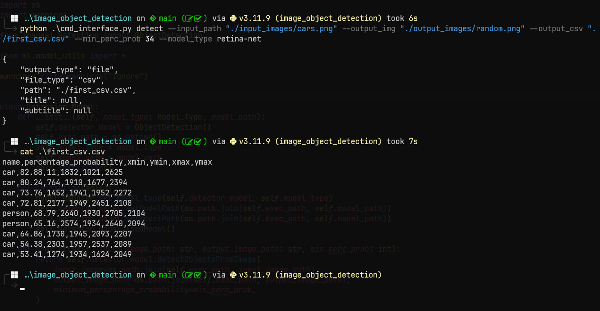

# Image Object Detection



### Installation

This project uses `pipenv` as its virtualenv management tool, which you will need to have installed:

1. Install pipenv
```bash
pip install pipenv
```
2. You will need to make sure you have `tkinter` installed. This can be done as the following according to your OS:

```bash
# Check if tkinter is installed:
python -m tkinter

# Otherwise, install it

# UBUNTU / DEBIAN
sudo apt-get install python3-tk

# MacOS
brew install python-tk@3.10

# Fedora
sudo dnf install python3-tkinter

# CentOS
sudo yum install python3-tkinter

# Make sure to specify correct Python version:
sudo apt-get install python3.10-tk
```

Now, just run the following command to activate the env and install all the dependencies

3. Activate the virtual environment
```bash
pipenv shell
```

4. Install dependencies
```bash
pipenv install
```

5. Downloading the models

We want to download the models and store them inside `ml/models/`. To achieve this, you can do the following:
```bash
cd ml
mkdir models
cd models
# Download tiny-yolov3 (size = 34 mb)
wget https://github.com/OlafenwaMoses/ImageAI/releases/download/3.0.0-pretrained/tiny-yolov3.pt 
# Download yolov3 (size = 237 mb)
wget https://github.com/OlafenwaMoses/ImageAI/releases/download/3.0.0-pretrained/yolov3.pt
# Download retina-net (size = 130 mb)
wget https://github.com/OlafenwaMoses/ImageAI/releases/download/3.0.0-pretrained/retinanet_resnet50_fpn_coco-eeacb38b.pth

# Go back to the project directory
cd ../..
```

### Starting the server

Ensure you are in the project directory and then simply: 
```bash
python -m backend.model_server
```

If you get an import error when running the server, you might need to do the following:
```bash
export PYTHONPATH=pwd # path to this project directory
```
or if you are using Windows:
```pwsh
set PYTHONPATH=%PYTHONPATH%;C:\project_path
```

### Command line tool

For the command line tool, you will need to specify the path to your input image, the path & name that you want for your output image & output csv and select one from the following models: retina-net, yolov3, tiny-yolov3.

Simply run:
```bash
python cmd_interface.py detech -h 
```
To learn how to pass in the arguments

There are sample images present in the `input_images` directory and a `output_images` directory where you can store your results as a way to test out this project.